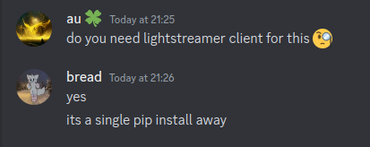

# astropee
turns out that every sensor on the International Space Station has its data publically available
so this script tells you every time someone on the ISS takes a pISS

## usage
put ur webhook url in `webhook_url.txt`, or look at `subscription_listener.py` to customize the code ran on urine tank level change
```
python3 monitor.py
```

## deps


## license
0BSD
